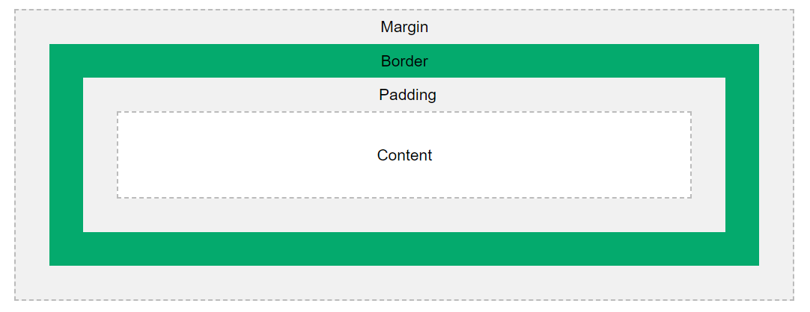

<!-- START doctoc generated TOC please keep comment here to allow auto update -->
<!-- DON'T EDIT THIS SECTION, INSTEAD RE-RUN doctoc TO UPDATE -->


- [CSS Box Model](#css-box-model)
  - [1.Defination](#1defination)
  - [2.Explanation of the Parts of CSS Box Model](#2explanation-of-the-parts-of-css-box-model)
    - [Content Area](#content-area)
    - [Padding Area](#padding-area)
    - [Border Area](#border-area)
    - [Margin Area](#margin-area)
  - [3.How  Box Model Work](#3how--box-model-work)
    - [Example](#example)
    - [Output](#output)

<!-- END doctoc generated TOC please keep comment here to allow auto update -->


# CSS Box Model
## 1.Defination

 *The CSS box model is a container that contains  multiple properties including borders, margin, padding, and the content itself  

 In CSS, the term "box model" is used when talking about design and layout. <br> 

 
 CSS box model
## 2.Explanation of the Parts of CSS Box Model
- Content - The content of the box, where text and images appear
- Padding - Clears an area around the content. The padding is transparent
- Border - A border that goes around the padding and content
- Margin - Clears an area outside the border. The margin is transparent

### Content Area
- Contains the actual data, such as text, images, or other media.
- Sized using the width and height properties.
- Bounded by the content edge.

### Padding Area
- Surrounds the content area.
- Space within the border box.
- Dimensions are determined by the width and height of the padding box.

### Border Area
- Lies between the padding and margin.
- Width and height are defined by the border.

### Margin Area
- Separates the element from adjacent elements.
- Dimensions specified by the margin-box width and height.

## 3.How  Box Model Work
Typically, when you assign the width and height of an attribute using the CSS width and height assets, it means you just positioned the height and width of the subject areas of that component. The additional height and width of the unit box is based on a range of influences.

The specific area that an element box may occupy on a web page is measured as follows-
- Height = height + padding-top + padding-bottom + border-top + border-bottom + margin-top + margin-bottom
- Width = width + padding-left + padding-right + border-left + border-right + margin-left + margin-right

### Example

```html
<!DOCTYPE html>
<html lang="en">
<head>
    <meta charset="UTF-8">
    <meta name="viewport" content="width=device-width, initial-scale=1.0">
    <title>Document</title>
    <style>   
        .learn  
        {   
            font-size:30px;   
            font-weight:bold;   
            text-align:left;   
        }   
        #box   
        {   
            padding-top:30px;   
            width: 300px;   
            height: 100px;   
            border: 40px solid pink;   
            margin: 30px;   
            text-align:center;   
            font-size:32px;   
            font-weight:bold;   
        }   
</style>
</head>
<body>  
        <div class="learn">CSS Box model</div>   
        <div id="box">Css box model</div>   
</body>   
</html>
```
### Output


<i>To learn more about Css box model [visit this site](https://www.google.com/search?q=css+box+model&rlz=1C1GCEA_enKE1058KE1058&oq=css+bo&gs_lcrp=EgZjaHJvbWUqDggAEEUYJxg7GIAEGIoFMg4IABBFGCcYOxiABBiKBTIGCAEQRRg5MgwIAhAAGEMYgAQYigUyDAgDEAAYQxiABBiKBTIMCAQQABhDGIAEGIoFMgcIBRAAGIAEMgYIBhBFGDwyBggHEEUYPKgCALACAA&sourceid=chrome&ie=UTF-8)


